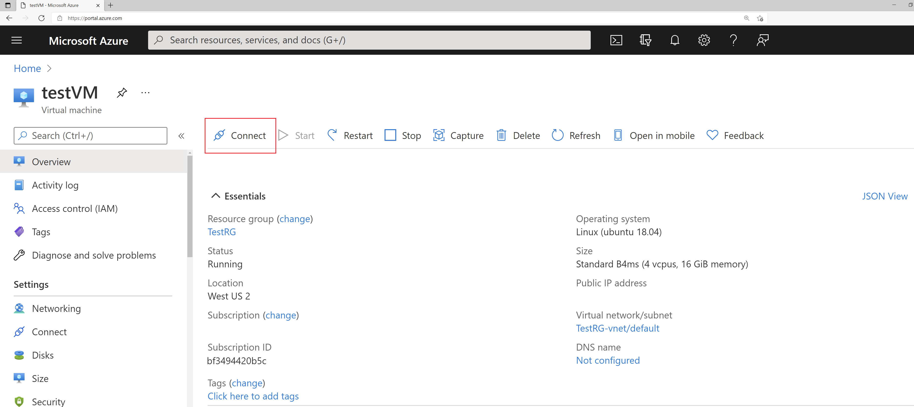
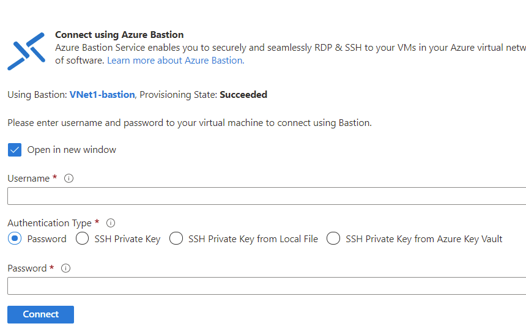

# Demonstration: Create an SSH connection to a Linux VM using Azure Bastion

In this demo you will use the Azure portal and your username and password to create an SSH connection to a Linux VM located in an Azure virtual network. When you use Azure Bastion, your VMs don't require a client, agent, or additional software.

## Prerequisites

To complete this demo, you will require an Azure virtual network containing a Linux VM. For more information about how to create an Azure VM, see [Demonstration: Create a virtual machine in the portal](https://github.com/MicrosoftLearning/AZ-120-Planning-and-Administering-Microsoft-Azure-for-SAP-Workloads/blob/master/Demos/demo-create-virtual-machine-portal.md), or [Demonstration: Create a virtual machine with PowerShell](https://github.com/MicrosoftLearning/AZ-120-Planning-and-Administering-Microsoft-Azure-for-SAP-Workloads/blob/master/Demos/demo-create-virtual-machine-powershell.md).

Make sure that you have set up an Azure Bastion host for the virtual network in which the VM resides. For more information, see [Create an Azure Bastion host](https://docs.microsoft.com/azure/bastion/tutorial-create-host-portal). Once the Bastion service is provisioned and deployed in your virtual network, you can use it to connect to any VM in this virtual network. 

### Required roles

In order to make a connection, the following roles are required:

* Reader role on the virtual machine
* Reader role on the NIC with private IP of the virtual machine
* Reader role on the Azure Bastion resource

### Ports

In order to connect to the Linux VM via SSH, you must have the following ports open on your VM:

* Inbound port: SSH (22) ***or***
* Inbound port: Custom value (you will then need to specify this custom port when you connect to the VM via Azure Bastion)

> **Note:** If you want to specify a custom port value, Azure Bastion must be configured using the Standard SKU. The Basic SKU does not allow you to specify custom ports. The Standard SKU is currently in Preview.

## Connect: Using username and password

1. Open the [Azure portal](https://portal.azure.com). Navigate to the virtual machine that you want to connect to, select **Connect**, and then select **Bastion** from the dropdown.

    

1. Select **Use Bastion**. If you didn't provision Bastion for the virtual network, see [Configure Bastion](https://docs.microsoft.com/azure/bastion/quickstart-host-portal).
1. On the **Connect using Azure Bastion** page, enter the **Username** and **Password**.

    

1. Select **Connect** to connect to the VM.